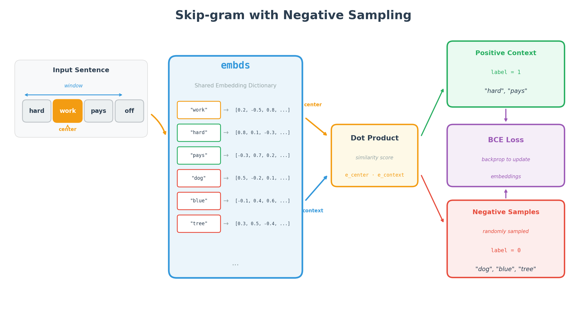

# Word2Vec From Scratch

A **PyTorch** implementation of the **Word2Vec Skip-gram** model with negative sampling, built entirely **from scratch** for educational purposes. This project demonstrates the core concepts behind **word embeddings** without relying on pre-built NLP libraries.

---

## Table of Contents

- [Overview](#overview)
- [Architecture](#architecture)
- [Technical Background](#technical-background)
- [Project Structure](#project-structure)
- [Installation](#installation)
- [Usage](#usage)
- [Configuration](#configuration)
- [Training Process](#training-process)
- [Results](#results)
- [Limitations](#limitations)
- [Future Improvements](#future-improvements)
- [License](#license)
- [References](#references)

---

## Overview

Word2Vec is a family of neural network models that learn dense vector representations (embeddings) of words from large corpora of text. These embeddings capture semantic relationships between words, enabling tasks such as analogy completion, similarity measurement, and downstream NLP applications.

This implementation focuses on the **Skip-gram** variant with **negative sampling**, where the model learns to predict context words given a center word while distinguishing true context words from randomly sampled negative examples.

---

## Architecture

<p align="center">
  
</p>

The model uses a **single shared embedding dictionary** (`embds`) for all words. Both center words and context words are looked up from this same dictionary. The dot product between embeddings measures similarity, and BCE loss trains the model to score positive pairs high and negative pairs low.

---

## Technical Background

### Skip-gram with Negative Sampling

For each word in the corpus, the model:

1. Takes the center word and looks up its embedding from `embds`
2. Extracts context words within a window and looks up their embeddings
3. Samples random negative words from the vocabulary
4. Computes dot product similarity between center and all context/negative embeddings
5. Uses BCE loss to push positive pairs together and negative pairs apart

### Mathematical Formulation

```
L = -[y * log(σ(e_center @ e_positive.T)) + (1 - y) * log(1 - σ(e_center @ e_negative.T))]
```

### Implementation

**Embedding Initialization** (`model.py`):
```python
embds = {word: torch.randn((EMB_DIM), device=DEVICE, requires_grad=True) for word in vocab}
```

**Forward Pass** (`model.py`):
```python
class Word2Vec(nn.Module):
    def __init__(self):
        super().__init__()
      
    def forward(self, center_emb, y_embds):
        return center_emb @ y_embds.T
```

---

## Project Structure

```
Word2Vec-From-Scratch/
├── Word2Vec/
│   ├── model.py        # Model definition and embedding initialization
│   ├── train.py        # Training loop
│   ├── data_prep.py    # Data loading and preprocessing
│   ├── utils.py        # Config and utility functions
│   └── check_sim.py    # Word similarity checking
├── data/
│   └── train/
│       └── data-00000-of-00001.arrow
├── images/
├── .gitignore
├── LICENSE
└── README.md
```

| File | Description |
|------|-------------|
| `model.py` | Defines `Word2Vec` class, initializes `embds`, runs training |
| `train.py` | Training loop with context extraction and negative sampling |
| `data_prep.py` | Loads Flickr30k, removes punctuation, builds sorted vocabulary |
| `utils.py` | Hyperparameters and utilities (`sample_negatives`, `euc_dist`, `cosine_sim`) |
| `check_sim.py` | Computes similarity between `WORD_A` and `WORD_B` |

---

## Installation

```bash
git clone https://github.com/franciszekparma/Word2Vec-From-Scratch.git
cd Word2Vec-From-Scratch
pip install torch numpy tqdm datasets
```

### Dependencies

| Package | Purpose |
|---------|---------|
| `torch` | Neural network framework |
| `numpy` | Numerical operations |
| `tqdm` | Progress bars |
| `datasets` | HuggingFace data loading |

---

## Usage

### Training

```bash
cd Word2Vec
python model.py
```

### Checking Word Similarity

Configure words in `utils.py`:
```python
WORD_A = "hard"
WORD_B = "work"
```

Then run:
```bash
python check_sim.py
```

Output:
```
Euclidean distance between "hard" and "work": 0.1234
Cosine Similarity between "hard" and "work": 0.8765
```

### Accessing Embeddings

```python
from model import embds
from utils import cosine_sim, euc_dist

# Get embedding
vec = embds["dog"]

# Compare words
emb_a = embds["cat"].unsqueeze(0)
emb_b = embds["dog"].unsqueeze(0)
print(f"Cosine similarity: {cosine_sim(emb_a, emb_b):.4f}")
```

---

## Configuration

Hyperparameters in `utils.py`:

| Parameter | Default | Recommended | Description |
|-----------|---------|-------------|-------------|
| `EMB_DIM` | 128 | 128-300 | Embedding dimensions |
| `WINDOW` | 4 | 5-10 | Context window size |
| `EPOCHS` | 32 | 10-50 | Training epochs |
| `SEED` | 24 | - | Random seed |
| `LOWER_WORDS` | True | True | Lowercase words |

---

## Training Process

<p align="center">
  
</p>

The training loop (from `train.py`):

```python
for epoch in tqdm(range(epochs)): 
    losses = []
    for w_l, word_list in enumerate(all_words_in_sen):
      for w, word in enumerate(word_list):    
        y_pos_words = word_list[max(0, w - WINDOW) : w] + word_list[w + 1 : w + WINDOW + 1] #the words that we want the target to be similar to 
        if len(y_pos_words) == 0:
          continue
        y_pos_embds = [embds[x] for x in y_pos_words]
        y_pos_labels = [1 for x in range(len(y_pos_words))]
        
        y_neg_words = sample_negatives(vocab, n=2*WINDOW, context_words=y_pos_words, center_word=word)
        y_neg_embds = [embds[x] for x in y_neg_words]
        y_neg_labels = [0 for x in range(len(y_neg_words))]
        
        y_embds = torch.stack(y_pos_embds + y_neg_embds)
        y_labels = torch.tensor(y_pos_labels + y_neg_labels, device=DEVICE, dtype=torch.float32)
      
        center_word = word
        center_emb = embds[center_word] #the word embedding that we are currently at
        
        y_preds = model(center_emb, y_embds)
        
        loss = loss_fn(y_preds, y_labels)
        losses.append(loss.item())
        
        optimizer.zero_grad()
        loss.backward()
        optimizer.step()
```

---

## Results

<p align="center">
  
</p>

With sufficient training (EMB_DIM=128+, EPOCHS=20+), semantically similar words cluster together in embedding space.

### Similarity Functions

```python
def euc_dist(emb1, emb2):
    return ((torch.sum((emb1 - emb2)**2))**0.5).item()

def cosine_sim(emb1, emb2):
    return ((emb1 @ emb2.T) / (torch.norm(emb1) * torch.norm(emb2))).item()
```

---

## Limitations

| Limitation | Solution |
|------------|----------|
| Uniform negative sampling | Frequency-based sampling (f^0.75) |
| No subsampling | Probabilistic downsampling |
| Dictionary storage | `nn.Embedding` layer |
| Sequential training | Mini-batching |

---

## Future Improvements

- [ ] Frequency-based negative sampling
- [ ] Subsampling frequent words
- [ ] Batch processing
- [ ] `nn.Embedding` layer
- [ ] Evaluation benchmarks (SimLex-999)
- [ ] CBOW variant

---

## License

MIT License - see [LICENSE](LICENSE)

---

## References

1. Mikolov et al. (2013). [Efficient Estimation of Word Representations in Vector Space](https://arxiv.org/abs/1301.3781)
2. Mikolov et al. (2013). [Distributed Representations of Words and Phrases](https://arxiv.org/abs/1310.4546)
3. [Flickr30k Captions Dataset](https://huggingface.co/datasets/embedding-data/flickr30k_captions_quintets)
